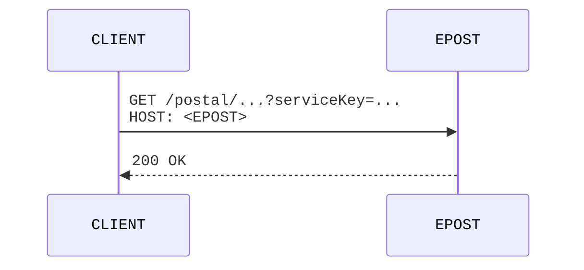
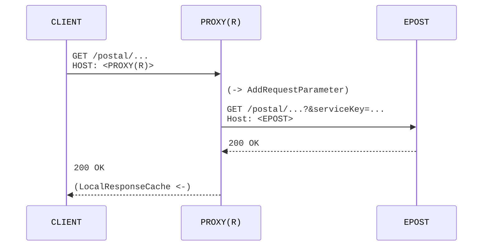
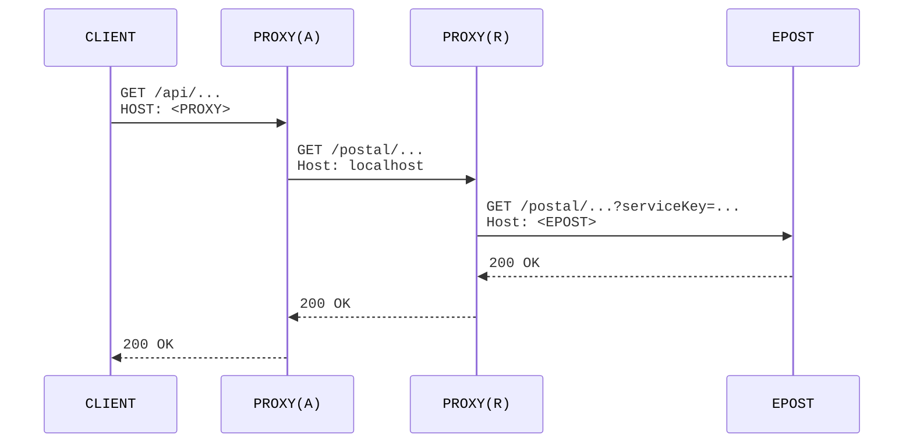

# epost-openapi-proxy

[](https://github.com/jinahya/epost-openapi-proxy/actions/workflows/maven.yml)
[](https://sonarcloud.io/summary/new_code?id=jinahya_epost-openapi-proxy)

## Abstract

An application for
proxying [과학기술정보통신부 우정사업본부 APIs](https://www.data.go.kr/tcs/dss/selectDataSetList.do?dType=API&keyword=%EA%B3%BC%ED%95%99%EA%B8%B0%EC%88%A0%EC%A0%95%EB%B3%B4%ED%86%B5%EC%8B%A0%EB%B6%80+%EC%9A%B0%EC%A0%95%EC%82%AC%EC%97%85%EB%B3%B8%EB%B6%80&operator=AND&detailKeyword=&publicDataPk=&recmSe=N&detailText=&relatedKeyword=&commaNotInData=&commaAndData=&commaOrData=&must_not=&tabId=&dataSetCoreTf=&coreDataNm=&sort=&relRadio=&orgFullName=&orgFilter=&org=&orgSearch=&currentPage=1&perPage=10&brm=&instt=&svcType=&kwrdArray=&extsn=&coreDataNmArray=&pblonsipScopeCode=)
using [Spring Cloud Gateway](https://spring.io/projects/spring-cloud-gateway).

기본적으로 [공공데이터포털] 에서 발급받은 `인증키`(`serviceKey`) 를 아용하여 `openapi.epost.go.kr` 를 호출하는 방법은 아래와 같다.



본 모듈은 아래와 같은 기능을 포함하고 있다.

* 설정된 `인증키`(`?serviceKey`)를 추가
* 응답 캐싱



추가로, 좀더 **세련된(?)**, API 가 정의되었다.



## Routes

아래에 열거된(개발된) 모든 서비스들에 대해 데이터 활용 신청을 해야 한다. (동일한 `인증키`에 `활용`이 추가되는 구조인 듯 하다.)

| api             | service              | route.id                                         | notes |
|-----------------|----------------------|--------------------------------------------------|-------|
| [우편번호 다운로드 서비스] | 우편번호 DB 다운로드 서비스     | `download_area_code_service`                     |       |      
| [영문우편번호조회서비스]   | 영문 우편번호 조회 서비스       | `retrieve_eng_address_service`                   |       |      
| [지번주소조회 서비스]    | 지번주소 5자리 우편번호 조회 서비스 | `retrieve_lot_number_adress_area_cd_service`     |       |      
| [우편번호 정보조회]     | 통합검색 5자리 우편번호 조회서비스  | `retrieve_new_adress_area_cd_search_all_service` |       |      
| [도로명주소조회서비스]    | 새주소 5자리 우편번호 조회서비스   | `retrieve_new_adress_area_cd_service`            |       |

### 우편번호 다운로드 서비스(`downloadAreaCodeService`)

<table>
  <thead>
    <tr><th>route</th><th>api</th><th>notes</th></tr>
  </thead>
  <tbody>
  <tr>
    <td><pre>/postal<br>&nbsp;&nbsp;/downloadAreaCodeService<br>&nbsp;&nbsp;&nbsp;&nbsp;/downloadAreaCodeService<br>&nbsp;&nbsp;&nbsp;&nbsp;&nbsp;&nbsp;/getAreaCodeInfo<br>&nbsp;&nbsp;&nbsp;&nbsp;&nbsp;&nbsp;&nbsp;&nbsp;?dwldSe=<{dwldSe}/pre></td>
    <td>b</td>
    <td>b</td>
  </tr>
  </tbody>
</table>

| route                                                              | api                                                              | notes |
|--------------------------------------------------------------------|------------------------------------------------------------------|-------|
|                                                                    | `/api/downloadAreaCodeService/areaCodeInfo`                      |       |
| `/postal/downloadAreaCodeService/<repeat>/getAreaCodeInfo?dwldSe=` | `/api/downloadAreaCodeService/areaCodeInfo/{dwldSe}`             |       |
|                                                                    | `/api/downloadAreaCodeService/areaCodeInfo/{dwldSe}/fileContent` |       |

## How to build

### JDK/JRE

최신의 JDK(`22`) 가 필요하다. (main 모듈은 `21` 을 기준으로 한다.)

```commandline
$ grep \<maven.compiler\\. pom.xml
    <maven.compiler.source>21</maven.compiler.source>
    <maven.compiler.target>${maven.compiler.source}</maven.compiler.target>
    <maven.compiler.release>${maven.compiler.target}</maven.compiler.release>
    <maven.compiler.testSource>22</maven.compiler.testSource>
    <maven.compiler.testTarget>${maven.compiler.testSource}</maven.compiler.testTarget>
    <maven.compiler.testRelease>${maven.compiler.testTarget}</maven.compiler.testRelease>
```

### How to test

```commandline
$ mvn clean test
```

### How to verify

발급받은 `인증키` 를 `SERVICE_KEY` 라는 이름의 환경 변수에 저장한다.

```commandline
$ SERVICE_KEY=<your-own-URL-DECODED-service-key> mvn -Pfailsafe clean verify
```

e.g.

```commandline
$ SERVICE_KEY='...==' mvn -Pfailsafe clean verify
```

---

## How to run

(본 모듈은 `@SpringBootApplication` 으로 annotate 된 class 를 (`main`이 아닌) `test` 모듈에 포함하고 있다.

아래와 같이 실행한 후 [Swagger UI](http://localhost:8080/swagger-ui.html) 를 열어서 확인한다.

```commandline
$ SERVICE_KEY='...==' mvn spring-boot:test-run
```

---

## How to use/extend

위에서 언급되었듯이, 본 모듈은 `@SpringBootApplication` 으로 annotate 된 class 를 (`main`이 아난) `test` 모듈에 포함하고 있다. 때문에 아래와 같이 추가해야 한다.

Add [`com.github.jinahya.openapi.proxy.NoOp.class`](src/main/java/com/github/jinahya/epost/openapi/proxy/_NoOp) to the
component-scanning path.

e.g.

https://github.com/jinahya/epost-openapi-proxy/blob/75b114f36b20a12d1ba93ead76818959c11f5735/src/test/java/com/mycompany/Application.java#L1-L17

---

## How to configure

[TBD]

---

## Links

### www.epost.go.kr

* [우편번호 DB와 검색기 소개](https://www.epost.go.kr/search/zipcode/cmzcd002k01.jsp)
    * [우편번호 DB파일](https://www.epost.go.kr/search/zipcode/areacdAddressDown.jsp)

### github.com

* [spring-cloud/spring-cloud-gateway](https://github.com/spring-cloud/spring-cloud-gateway)
    * [Double encoded URLs](https://github.com/spring-cloud/spring-cloud-gateway/issues/2065) (issues/2065)
    * [Route Configuration Not Merging from Imported YAML Files](https://github.com/spring-cloud/spring-cloud-gateway/issues/3098)
    * [#3466 AddRequestParameter double encodes parameter value](https://github.com/spring-cloud/spring-cloud-gateway/issues/3466)
    * [#3474 Forwarding route produces error at the first request](https://github.com/spring-cloud/spring-cloud-gateway/issues/3474)
* [tdf/odftoolkit](https://github.com/tdf/odftoolkit)

### [ODFDOM - The OpenDocument API](https://odftoolkit.org/odfdom/index.html)

### [langintro.com](https://langintro.com/)

* [Creating Spreadsheet Documents Using ODFDOM](https://langintro.com/odfdom_tutorials/create_ods.html)

### https://mimetype.io

* [All MIME types](https://mimetype.io/all-types)

### https://www.iana.org

* [/assignments/media-types/application/zip](https://www.iana.org/assignments/media-types/application/zip)

### stackoverflow.com

* [How to encode the filename parameter of Content-Disposition header in HTTP?](https://stackoverflow.com/q/93551/330457)
* [HATEOAS: absolute or relative URLs?](https://stackoverflow.com/q/2239405/330457)
* [Spring Boot Unit Test ignores logging.level](https://stackoverflow.com/a/41639534/330457)

### [developers.mozilla.org](https://developer.mozilla.org) ([en_US](https://developer.mozilla.org/en_US/))

* [/docs/Web/HTTP/Headers/Content-Disposition](https://developer.mozilla.org/docs/Web/HTTP/Headers/Content-Disposition) ([en_US](https://developer.mozilla.org/en-US/docs/Web/HTTP/Headers/Content-Disposition))

---

[공공데이터포털]: https://www.data.go.kr/

[우편번호 다운로드 서비스]: https://www.data.go.kr/data/15000302/openapi.do

[영문우편번호조회서비스]: https://www.data.go.kr/data/15059038/openapi.do

[지번주소조회 서비스]: https://www.data.go.kr/data/15000268/openapi.do

[우편번호 정보조회]: https://www.data.go.kr/data/15056971/openapi.do

[도로명주소조회서비스]: https://www.data.go.kr/data/15000124/openapi.do

[집배구 구분코드 조회서비스]: https://www.data.go.kr/data/15057018/openapi.do
